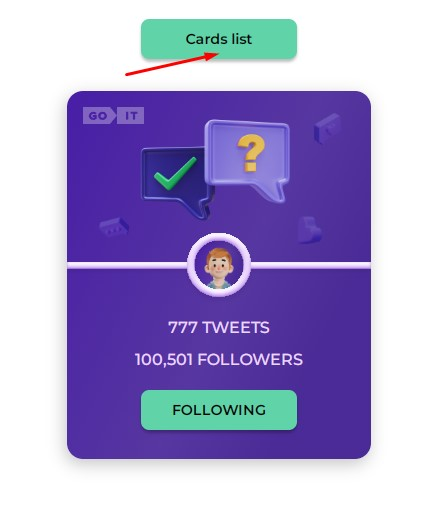

## Приложение - карточка пользователя твиттера.

1. Создан макет одной карточки пользователя твиттера:

   

2. При клике на кнопку FOLLOW её текст изменяется на FOLLOWING, и цвет фона
   меняется с белого на зеленый. А количество фоловеров увеличивается на 1. Т.
   е., если первоначальное количество составляло 100,500 фоловеров, то после
   нажатия на кнопку оно будет составлять 100,501 фоловеров.
3. Результат фиксируется и после перезагрузки страницы отображается последнее
   состояние карточки до перезагрузки, т. е. кнопка будет иметь зеленый цвет
   фона с надписью FOLLOWING, а количество фоловеров будет равно 100,501:

   

4. При повторном нажатии на кнопку состоянии каточки возвращается к
   первоначальному. Кнопка снова будет иметь белый цвет фона с надписью FOLLOW,
   а количество фоловеров снова будет равно 100,500.

## Список карточек пользователей твиттера.

1. Для генерации нескольких карточек пользователей твиттера создан json-файл,
   эмулирующий базу данных пользователей.
2. Чтобы перейти на страницу с несколькими карточками достаточно кликнуть на
   кнопку Card list вверху страницы:

   

3. Приложение создаст на странице карточки всех пользователей из json-файла
   (мнимой базы данных):

   

4. Логика работы каждой из карточек полностью повторяет логику работы одной
   карточкой и является независимой друг от друга.
5. Т.е. клик по кнопке на одной из карточек изменит состояние только этой
   карточки. Это состояние будет зафиксировано, и после перезагрузки станицы
   каждая из карточек вернется в то состояние, в котором она была до
   перезагрузки:

   

6. Для возврата на страницу с одной карточкой надо нажать на кнопку One card:

